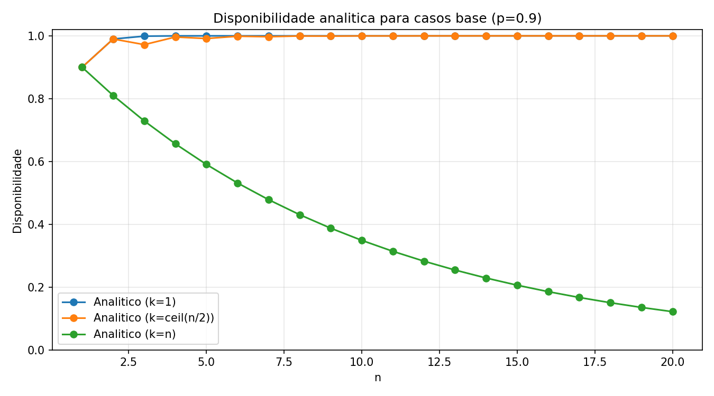
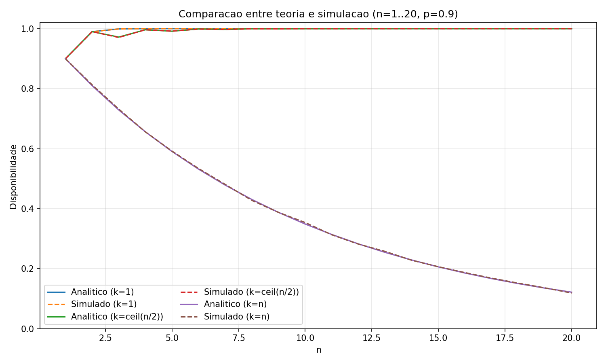

# Análise de Disponibilidade em Serviços Replicados

## GRUPO G

- **NOME:** Joey Alan de Freitas Solis — **MATRÍCULA:** 2320416  
- **NOME:** Hector Zendejas Rebouças — **MATRÍCULA:** 2315024  

---

## Introdução

Em sistemas distribuídos, a replicação de servidores é uma técnica amplamente utilizada para aumentar a disponibilidade de um serviço.

Quando um serviço é replicado em vários servidores, ele pode continuar operando mesmo que alguns servidores falhem.

Neste trabalho analisamos a disponibilidade de um serviço replicado utilizando três abordagens:

1. Análise matemática da disponibilidade  
2. Simulação estocástica do sistema  
3. Cálculo do número mínimo de réplicas necessárias para atingir diferentes níveis de disponibilidade ("noves")  

Os parâmetros utilizados são:

- **n** → número total de servidores  
- **k** → número mínimo de servidores disponíveis para o serviço funcionar  
- **p** → probabilidade de um servidor estar disponível  

---

# Exercício 1.1 — Dedução da Fórmula de Disponibilidade

Cada servidor possui:

- probabilidade **p** de estar disponível  
- probabilidade **(1 − p)** de falhar  

Assumindo independência entre os servidores, o número de servidores disponíveis segue uma distribuição binomial.

A probabilidade de **exatamente i servidores estarem disponíveis** é:

**P(i) = C(n,i) * p^i * (1-p)^(n-i)**

onde:

**C(n,i) = n! / (i!(n-i)!)**

O serviço permanece disponível quando **pelo menos k servidores estão ativos**.

Portanto, a disponibilidade do sistema é:

**A(n,k,p) = Σ(i=k até n) C(n,i) p^i (1-p)^(n-i)**

---

## Casos extremos

### Caso 1 — k = 1 (operações de leitura)

O serviço funciona se **pelo menos um servidor estiver ativo**.

A disponibilidade pode ser calculada como:

**A = 1 − (1 − p)^n**

### Caso 2 — k = n (operações de escrita)

Todos os servidores precisam estar disponíveis.

A disponibilidade é:

**A = p^n**

---

# Exercício 1.2 — Cálculo Analítico

A fórmula derivada foi implementada em Python para calcular a disponibilidade do sistema para diferentes valores de:

- **n** (número de servidores)  
- **k** (quórum mínimo)  
- **p** (probabilidade de disponibilidade)  

Foram analisados três cenários principais:

- **k = 1**
- **k = ceil(n/2)**
- **k = n**

Os resultados foram organizados em tabelas e gráficos.

Na implementação atual (`comparacao_teoria_simulacao.py`), foi utilizada a faixa:

- **n = 1, 2, ..., 20**
- **p em {0.5, 0.8, 0.9}**
- casos de **k: 1, ceil(n/2), n**

Observa-se que quanto maior o valor de **k**, menor a disponibilidade do sistema, pois mais servidores precisam estar simultaneamente ativos.

## Resultados Analíticos

A figura abaixo apresenta a disponibilidade analítica do sistema para diferentes valores de **n**, considerando os três casos base com **p = 0.9**.

- Quando **k = 1**, a disponibilidade cresce rapidamente e se aproxima de 1.
- Quando **k = ceil(n/2)**, a disponibilidade também permanece alta.
- Quando **k = n**, a disponibilidade diminui conforme **n** cresce, pois todos os servidores precisam estar disponíveis ao mesmo tempo.

<p align="center">
  
</p>

---

# Exercício 1.2 — Simulação Estocástica

Além do cálculo analítico, foi implementado um simulador estocástico.

O simulador realiza várias rodadas onde:

1. Para cada servidor é gerado um número aleatório entre 0 e 1  
2. Se o valor gerado for menor ou igual a **p**, o servidor é considerado disponível  
3. Conta-se o número de servidores disponíveis  
4. Verifica-se se o número de servidores ativos é maior ou igual a **k**  

Na comparação automática, foram usadas **50.000 rodadas** por combinação de parâmetros.

A disponibilidade experimental é então calculada como:

**disponibilidade = rodadas bem-sucedidas / total de rodadas**

Os resultados simulados são comparados com os valores teóricos.

Quando o número de rodadas é grande, os valores experimentais convergem para os valores analíticos.

## Comparação entre Teoria e Simulação

A figura abaixo compara os valores calculados analiticamente com os valores obtidos por simulação para **p = 0.9**.

Percebe-se que as curvas simuladas acompanham muito de perto as curvas teóricas, o que confirma a validade do modelo matemático e da implementação do simulador.

<p align="center">
  
</p>

Ao executar `comparacao_teoria_simulacao.py`, são gerados automaticamente:

- `tabela_teoria_vs_simulacao.csv` — valores analíticos e experimentais lado a lado  
- `grafico_disponibilidade_analitica.png` — curvas analíticas para os casos base com **p = 0.9**  
- `grafico_teoria_vs_simulacao.png` — comparação entre teoria e simulação com **p = 0.9**  

---

# Exercício 1.3 — Número de Réplicas para Atingir "Noves"

Neste exercício analisamos quantas réplicas são necessárias para atingir níveis específicos de disponibilidade.

Os parâmetros fixados foram:

- **n** variável  
- **k = 1**  
- **p = 0.5**  

A fórmula utilizada foi:

**A = 1 − (1 − p)^n**

Substituindo **p = 0.5**:

**A = 1 − (0.5)^n**

Para encontrar o número mínimo de servidores necessário para atingir uma disponibilidade desejada **f**, isolamos **n**:

**n ≥ log(1 − f) / log(0.5)**

## Resultados

| Disponibilidade | Nome comum | n mínimo |
|-----------------|------------|----------|
| 0.9             | 1 nove     | 4        |
| 0.99            | 2 noves    | 7        |
| 0.999           | 3 noves    | 10       |
| 0.9999          | 4 noves    | 14       |
| 0.99999         | 5 noves    | 17       |
| 0.999999        | 6 noves    | 20       |

## Análise

Os resultados mostram que o número de réplicas cresce de forma aproximadamente logarítmica.

Mesmo quando cada servidor possui apenas **50% de chance de estar disponível**, a replicação permite atingir níveis muito altos de disponibilidade.

Para atingir **seis noves (99.9999%)**, são necessários aproximadamente **20 servidores replicados**.

Isso demonstra o poder da replicação para aumentar a confiabilidade de sistemas distribuídos.

---

# Conclusão

A replicação de servidores é uma técnica fundamental para aumentar a disponibilidade de serviços distribuídos.

Os resultados mostraram que:

- sistemas com **k baixo** possuem maior disponibilidade  
- exigir muitos servidores ativos reduz a disponibilidade  
- a replicação permite atingir níveis extremamente altos de confiabilidade  
- as simulações confirmam os resultados matemáticos  

O estudo demonstra como modelos probabilísticos podem ser utilizados para projetar sistemas distribuídos mais confiáveis.

---

# Como Executar

Use os comandos abaixo no terminal, dentro da pasta do projeto.

## 1. Exercício 1.2 — Parte analítica

```bash
python codigo_analitico.py
